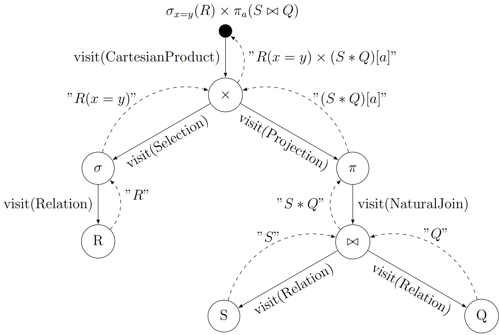
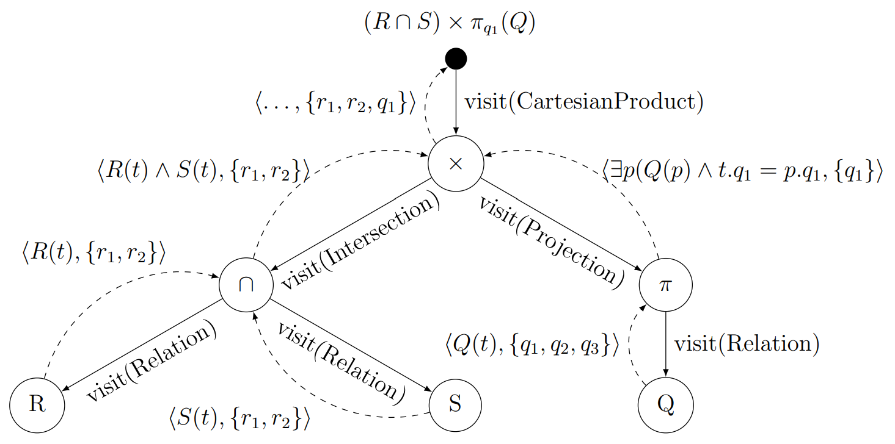

## Introduction

This project serves as a backend for my [bachelor's thesis](https://dspace.cvut.cz/handle/10467/101022). The frontend is available [here](https://github.com/tomashauser/relational-converter-frontend).

The purpose of the application is to provide a way to convert between two widely used relational algebra notations.

Moreover, the tool can also convert queries from relational algebra into relational calculus.

## Structure
The backend follows a layered architecture. The REST controllers in the presentation layer take care of the incoming requests while the service layer prepares the data for the most important component of the system – the converters.

  

## Parsing

The application uses ANTLR to parse the user input. In the directory `src/main/antlr4` there are grammar files that specify what the user input should look like. When prompted, ANTLR generates code that can parse an input of this format into `app/languages/ra/antlr4files`. This also contains extendable visitors through which an abstract syntax tree (AST) can be constructed. AST is a class hierarchy that copies the grammar and serves as a representation of the user input that can be manipulated and worked with in code. In the image below on the left, the upper rectangle shows the ANTLR generated classes. Underneath, there are classes which extend the generated visitors. The class diagram on the right depicts the structure of the AST.

  
  

## Converters
There are two converters – one for converting relational algebra (RA) into tuple relational calculus (TRC) and one to convert between two RA notations. Both converters utilize the visitor design pattern. The class diagram blow captures the relationships between the converters, visitors and other parts of the system. 

  

## Conversion Process
In order to pefrom a converison between the two RA notation, the converter takes a pre-order path through the AST and, at each level, perfroms an appropriate string transformation. The diagram below showcases the calls and return values for the conversion of the expression at the root. The filled arrows represent a method call, while the dashed ones show the return
value. We can see that the branching always stops at the relation level as it is the only terminal symbol in RA.

  

The conversion from RA to TRC is a little more complicated. Returning just the resulting TRC `Formula` from each visitor class would not be sufficient as some operations such as Cartesian product or division need to have the knowledge of the resulting header of the subexpression. For that reason a pair `<Formula, Header>` is returned from each visit method. In the example below both $R$ and $S$ have attributes $r_1$, $r_2$ and $Q$ has attributes $q_1$, $q_2$, $q_3$. 

  

Notice that the projection and Cartesian product both return a different header. Without the headers, the Cartesian product visit method would have no way of knowing that the $q_1$ has been projected onto, and it would add the $q_2$ and $q_3$ back into the resulting expression.

