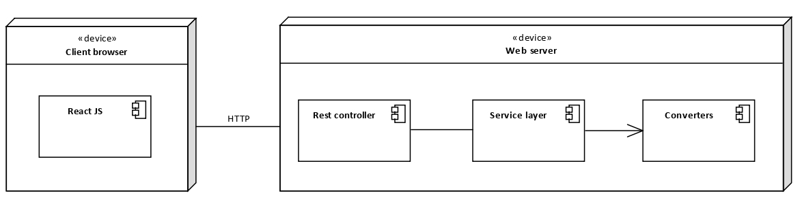
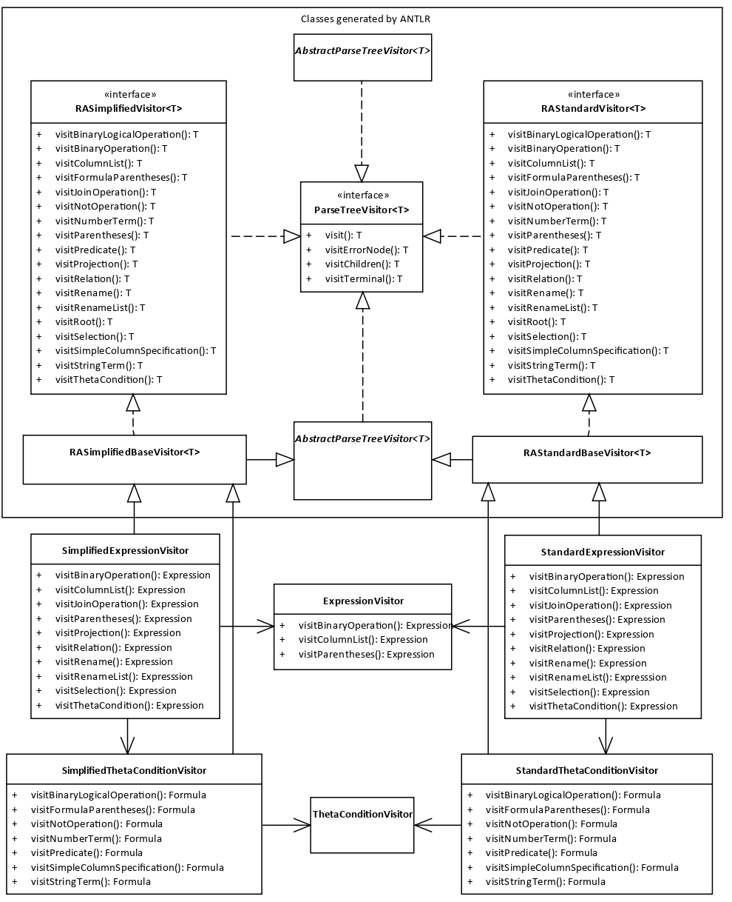
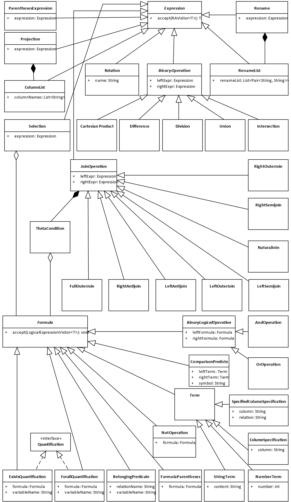
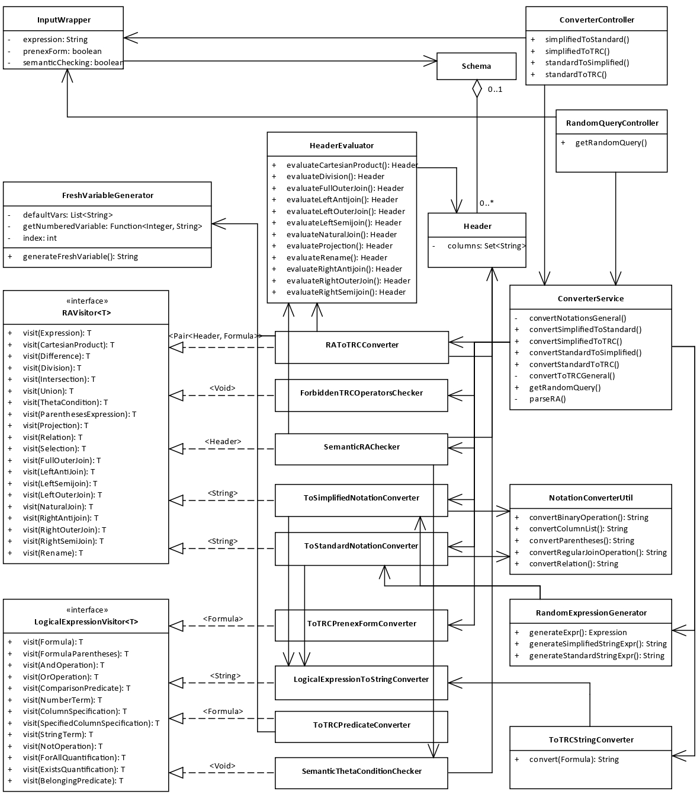

This project serves as a backend for my [bachelor's thesis](https://dspace.cvut.cz/handle/10467/101022).

The purpose of the application is to provide a way to convert between two widely used relational algebra notations.

Moreover, the tool can also convert queries from relational algebra into relational calculus.

# How does it work?

## Structure
The backend follows a layerd architecture. The REST controllers in the presentation layer take care of the incoming requests and the service layer prepares the data for the most important component of the system – the converters.

  

## ANTLR

The application uses ANTLR to parse the user input. In the directory `src/main/antlr4` there are grammar files that specify what the user input should look like. When prompted, ANTLR generates code that can parse an input of this format into `app/languages/ra/antlr4files`. This also contains extendable visitors through which an abstract syntax tree (AST) can be constructed. AST is a class hierarchy that copies the grammar and serves as a representation of the user input that can be manipulated and worked with in code. In the image below on the left, the upper rectangle shows the ANTLR generated classes. Underneath, there are classes which extend the generated visitors. The class diagram on the right depicts the structure of the AST.

  
  

## Converters
There are two converters – one for converting relational algebra (RA) into tuple relational calculus (TRC) and one to convert between two RA notations. Both converters utilize the visitor design pattern. The class diagram blow captures the relationships between the converters, visitors and other parts of the system. 

  

