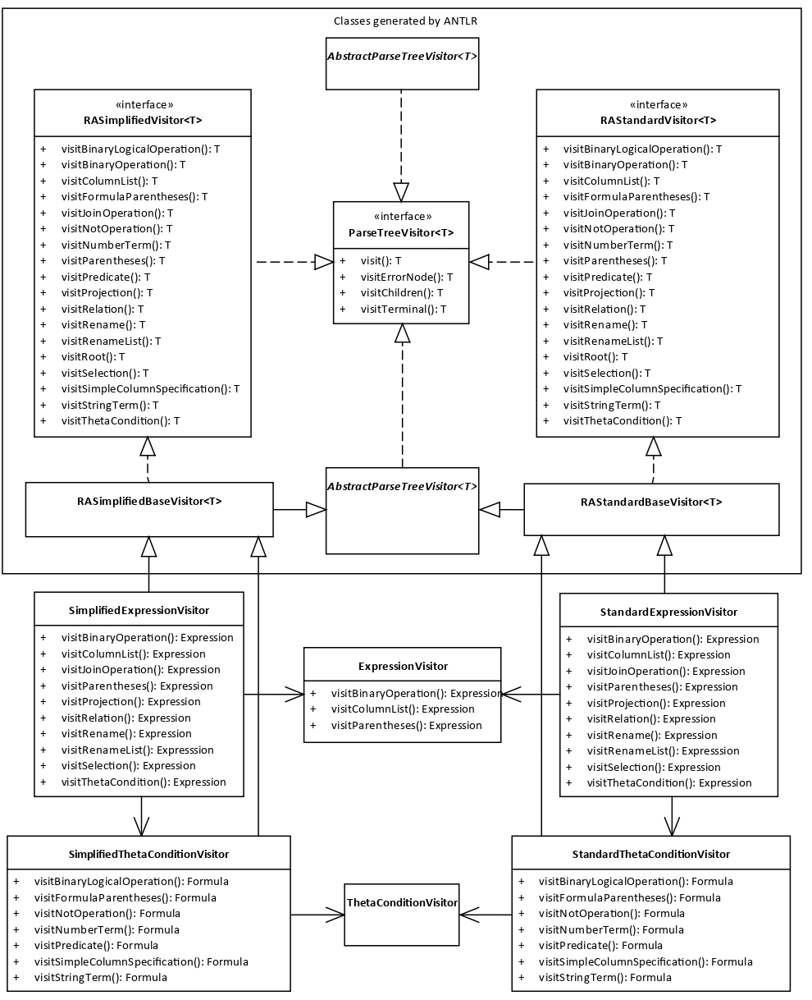

This project serves as a backend for my [bachelor's thesis](https://dspace.cvut.cz/handle/10467/101022).

The purpose of the application is to provide a way to convert between two widely used relational algebra notations.

Moreover, the tool can also convert queries from relational algebra into relational calculus.

